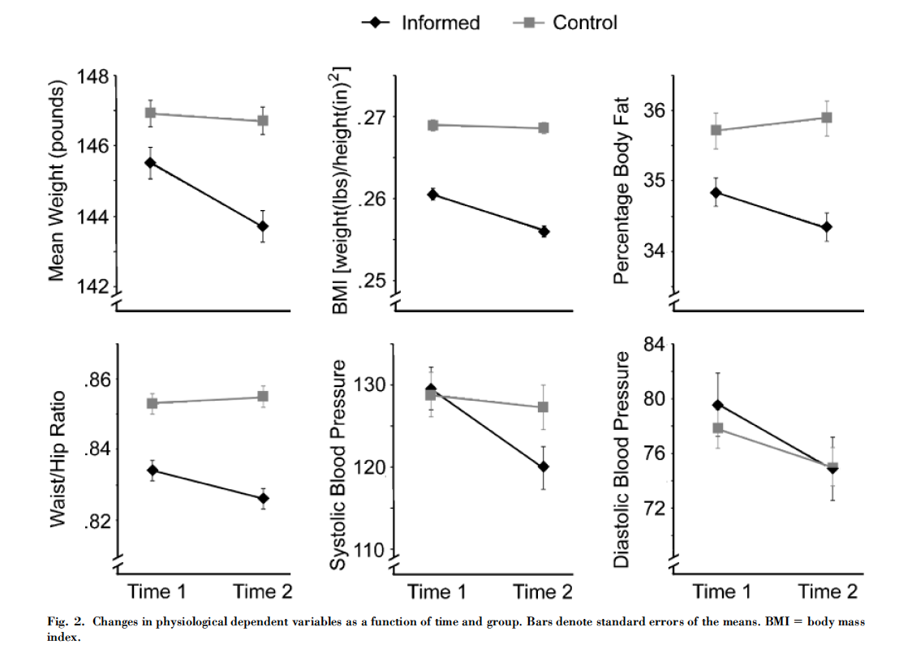
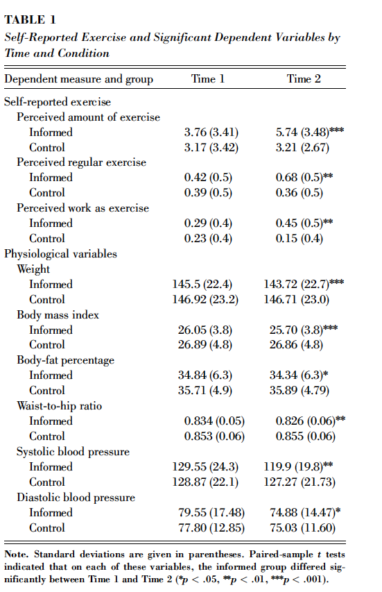
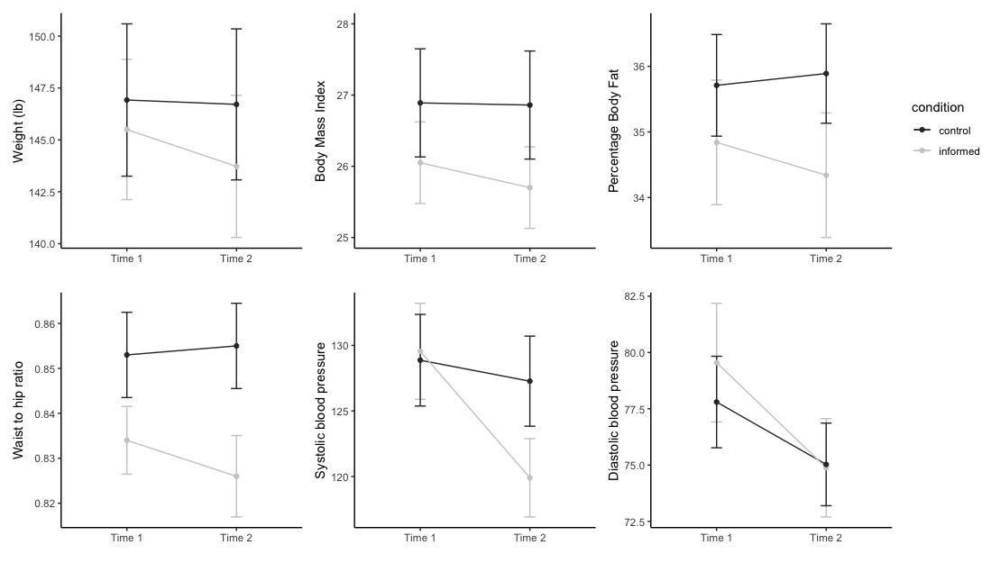

# Crum_Langer_Graphs
This is code I wrote as an example for my fourth-year Research Methods in Psychology class, to visualise some data from this paper: 

Crum, A. J., & Langer, E. J. (2007). Mind-set matters: Exercise and the placebo effect. Psychological Science, 18(2), 165–171. https://doi.org/10.1111/j.1467-9280.2007.01867.x

This paper is widely and uncritically cited in textbooks, but when examined in detail it has some very odd quirks! One glaring issue I noticed was the error bars in Figure 2. 

These are based on the physiological variables which are reported in Table 1: 

However, one thing you'll immediately notice from this table is that it's hard to see how those differences could be significant if the standard deviations are really that large, 
even with the very dubious approach of just doing a paired t-test for the informed group and ignoring the controls. 

Those error bars in Figure 2 - how could they be that small? So I decided to re-plot them, calculating the standard error based on the N for the informed group being 44 and 
N for the control group being 40, as reported in the paper - so $SE = SD/\sqrt(N)$. This is what my plot looks like, and I have included the code to reproduce the plot.

What do you think? 
